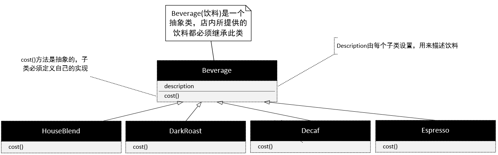
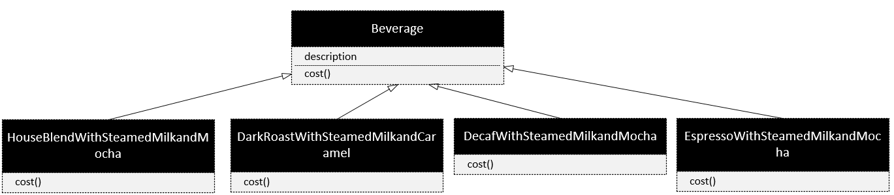

# 项目介绍
星巴兹(Starbuzz)是以扩张速度最快而闻名的咖啡连锁店。  
因为扩张的速度实在太快了，他们准备更新订单系统，以合乎他们的饮料供应要求。

购买咖啡时，也可以要求在其中加入各种调料，例如：蒸奶(Steamed Milk)、豆浆(Soy)、摩卡(Mocha)或覆盖奶泡。星巴兹会根据所加入的调料收取不同的调料费用。所以订单系统必须考虑到这些调料部分。

错误的设计：

这样设计会新建非常多得类。如果牛奶的加钱上扬或者新增一种焦糖风味的调料将需要改动很多代码。

# 认识装饰模式

我们已经了解利用继承无法完全解决问题，在星巴兹遇到的问题有：

- 类数量过多
- 设计死板
- 积累加入的新功能并不适用于所有子类

所以，在这里要采用不一样的做法：我们以饮料为主体，然后在运行时以调料来"装饰"(decorate)饮料。比如,如果顾客想要摩卡和奶泡深焙咖啡，那么要做的是：

1. 拿一个深焙咖啡(DarkRoast)对象
2. 以(Mocha)对象装饰它
3. 以奶泡(Whip)对象装饰它
4. 调用cost()方法，并依赖委托(delegate)将调料的价钱加上去

装饰模式特性
- 装饰者和被装饰对象有相同的超类型。
- 可以用一个或多个装饰者包装一个对象。
- 在任何需要原始对象(被包装的)的场合，可以用装饰过的对象代替它。
- **装饰者可以在所委托被装饰者的新各位之前与之后，加上自己的行为，已达到特定的目的。**
- 对象可以在任何时候被装饰，所以可以在运行时动态地、不限量地用装饰者来装饰对象，

