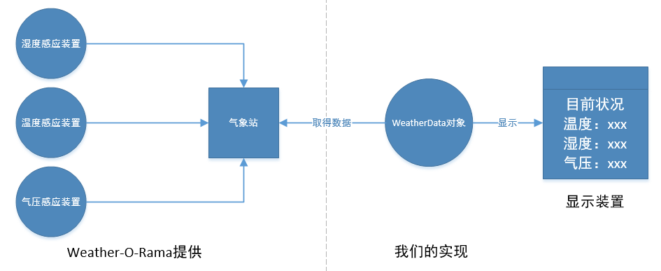
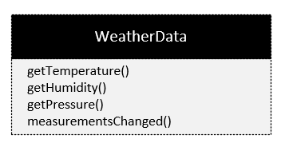
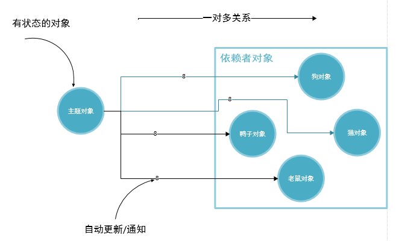
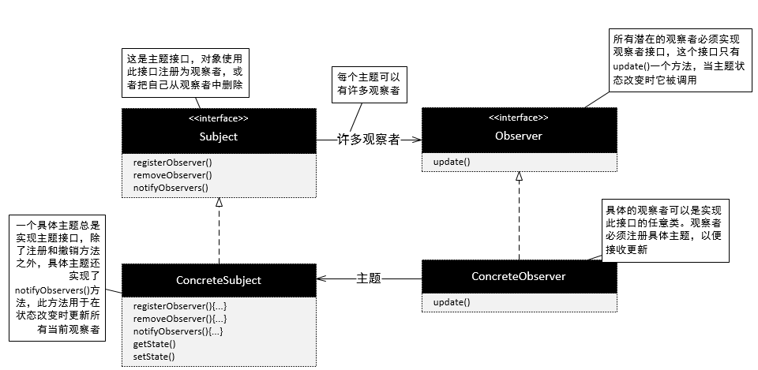
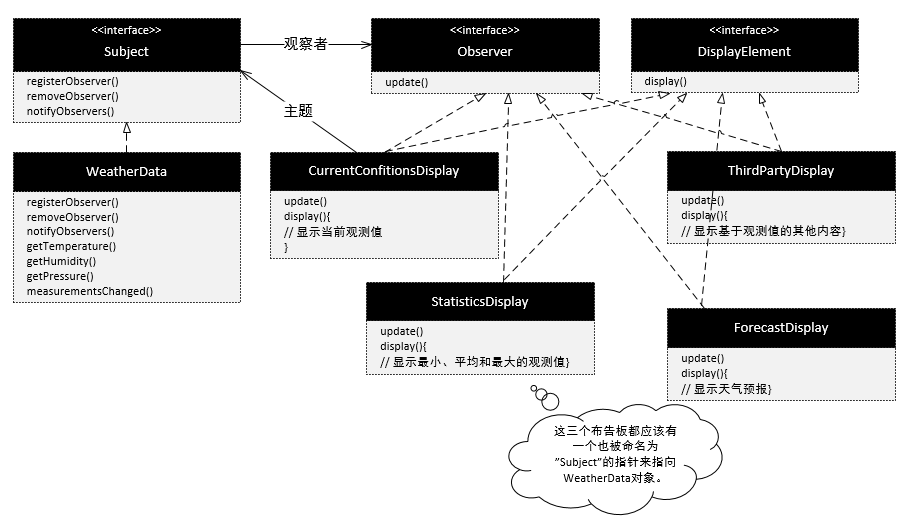

# 项目介绍
建立Weather-O-Rama公司的下一代气象站-Internet气象站。该气象站必须建立在WeatherData对象上，由WeatherData对象负责追踪目前的天气状况(温度、湿度、气压)。建立一个应用，有三种布告板，分别显示目前的状况、气象统计及简单的预报。  
这是一个可以拓展的气象站，Weather-O-Rama气象站希望公布一组API，好让其他开发人员可以写出自己的气象布告板，并插入到此应用中。

# 气象监测应用的概况
此系统中的三个部分是气象站(获取实际气象数据的物理装置)、WeatherData对象(追踪来自气象站的数据，并更新布告板)和布告板(显示目前天气状况给用户看)。



WeatherData对象知道如何跟物理气象站联系，以取得更新的数据。WeatherData对象会随即更新三个布告板的显示：目前状况(温度、湿度、气压)、气象统计和天气预报。

> 如果我们选择接受这个项目，我们的工作就是建立一个应用，利用WeatherData对象取得数据，并更新三个布告板：目前状况、气象统计和天气预报。

**WeatherData类**  


WeatherObject的开发人员留了一些线索，好让我们知道应该加些什么
```java
/**
* 一旦气象测量更新，此方法会被调用
*/
public void measurementsChanged(){
    // 你的代码加在这里
}
```
# 一个错误的例子
```java
public class WeatherData(){
    // 实例变量声明
    
    public void measurementsChanged(){
        float temp = getTemperature();  // 调用WeatherData的三个
        float humidity = getHumidity(); // getXxx()方法，已取得最
        float pressure = getPressure(); // 的测量值。
        
        // 调用每个布告板更新显示，传入最新的测量值。
        // 针对具体实现编程,会导致我们以后在增加或者删除布告板时必须修改程序.
        currentConditionsDisplay.update(temp,humidity,pressure);
        statisticsDisplay.update(temp,humidity,pressure);
        forecastDisplay.update(temp,humidity,pressure);
    }
}
```


> 主题和观察者定义了一对多的关系。观察者依赖此主题，只要主题一有变化，观察者就会被通知。

# 定义观察者模式：类图


# 设计气象站


# 实现气象站
```java
public interface Subject {
    void registerObserver(Observer o); // 这两个方法都需要一个观察者作为变量，
    void removeObserver(Observer o);   // 该观察者是用来注册或被删除的。
    void notifyObservers(); // 当主题状态改变时,这个方法会被调用,以通知所有的观察者.
}

public interface Observer {
    void update(float temp,float humidity,float pressure); // 所有的观察者都必须实现update()方法，以实现观察者接口。
}

public interface DisplayElment {
    void display(); // 当布告板需要显示时调用此方法。
}
```

# 在WeatherData中实现主题接口
```java
public class WeatherData implements Subject {
    private ArrayList observers;
    private float temperature;
    private float humidity;
    private float pressure;
    
    public WeatherData() {
        observers = new ArrayList();
    }
    
    public void registerObserver(Observer o) {
        observers.add(o);
    }
    
    public void removeObserver(Observer o) {
        int i = observers.indexOf(o);
        if (i >= 0) {
            observers.remove(i);
        }
    }
    
    public void notifyObservers(){
        for (int i = 0; i < observers.size(); i++) {
            Observer observer = (Observer)observers.get(i);
            observer.update(temperature,humidity,pressure);
        }
    }
    
    public void measurementsChanged() {
        notifyObservers();
    }
    
    public void setMeasurements(float temperature, float humidity, float pressure) {
        this.temperature = temperature;
        this.humidity = humidity;
        this.pressure = pressure;
        measurementsChanged();
    }
    
    // WeatherData的其他方法
    
}
```

# 建立布告板
```java
public class CurrentConditionsDisplay implements Observer, DisplayElement {
    private float temperature;
    private float humidity;
    private float pressure;
    private Subject weatherData;
    
    public CurrentConditionsDisplay(Subject weatherData) {
        this.weatherData = weatherData;
        weatherData.registerObserver(this);
    }
    
    public void update(float temperature, float humidity, float pressure) {
        this.temperature = temperature;
        this.humidity = humidity;
        display();
    }
    
    public void display() {
        System.out.println("Current conditions: " + temperature + "F degrees and " + humidity + "% humidity");
    }
}
```