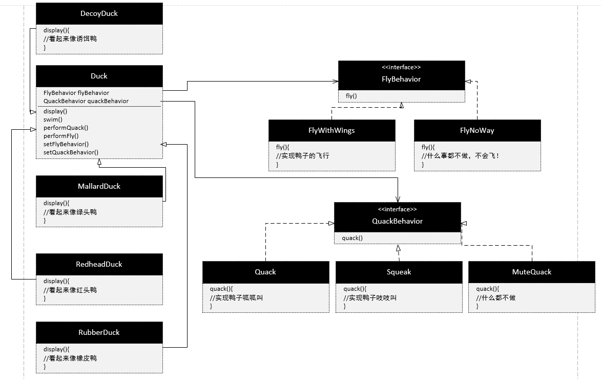

# 项目介绍
Joe上班的公司做了一套相当成功的模拟鸭子游戏。游戏中会出现各种鸭子，一边游泳戏水，一边呱呱叫。此系统的内部设计使用标准的OO技术，设计了一个鸭子超类(Duck)，并让各种鸭子继承此超类。

## 项目需求更新  
一周后主管决定此模拟程序需要会费的鸭子来将竞争者抛在后头。

解决方案：
1. 在超类Duck上新增fly()方法  
这将导致所有的子类都具备fly()行为，但并非所有鸭子都会飞。可以将子类中的fly方法覆盖，这样会使代码在多个子类重复。
2. 让子类实现Flyable接口  
如果子类众多，每个子类都要修改实现飞行行为。
3. 使用策略模式，将飞行抽象成行为接口，并将接口组合到Duck超类中，不同子类只需要传入不同的行为实现类，也可以在运行的过程中改变对象的行为。

**策略模式类图**
